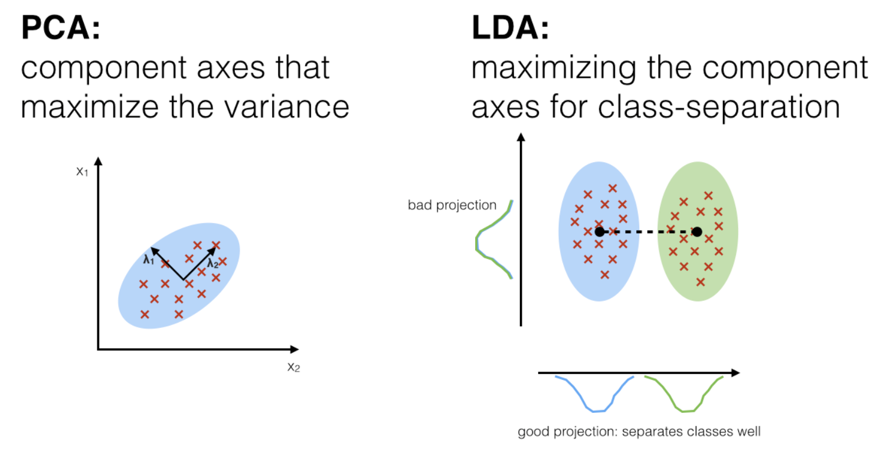

#### Unsupervised Dimension Reduction
##### PCA 
$\mathcal{D}_{n} = \{x_{1}, \cdots, x_{n} \}$ with $x_{i} \in \mathbb{R}^{d}$, find $w \in \mathbb{R}^{d\times k}$ 

$$
w^{\ast} = argmin_{\lVert w \rVert_{2} = 1}\sum_{i=1}^{n}\lVert wz_{i} - x_{i} \rVert_{2}^{2}
$$
with 
$w$ orthogonal (i.e., $w^{-1} = w^{T}$). 

$$z_{i} = w^{T}x_{i}$$

with $z_{i} \in \mathbb{R}^{k}$ and $k << d$.

$$
\begin{equation}
\begin{split}
\lVert wz_{i} - x_{i} \rVert_{2}^{2} & = (x_{i}-ww^{T}x_{i})^{T}(x_{i}-ww^{T}x_{i})\\
& = x_{i}^{T}x_{i} - 2x_{i}^{T}ww^{T}x_{i} + x_{i}^{T}ww^{T}ww^{T}x_{i} \\
& = x_{i}^{T}x_{i} - 2x_{i}^{T}ww^{T}x_{i} + x_{i}^{T}ww^{T}x_{i} \\
& = x_{i}^{T}x_{i} - x_{i}^{T}ww^{T}x_{i} \\
& = x_{i}^{T}x_{i} - (w^{T}x_{i})^{T}(w^{T}x_{i})
\end{split}
\end{equation}
$$

$$
\begin{equation}
\begin{split}
w^{\ast} & = argmin_{\lVert w \rVert_{2} = 1}\sum_{i=1}^{n}\lVert wz_{i} - x_{i} \rVert_{2}^{2} \\ 
& = argmax_{\lVert w \rVert_{2} = 1}\sum_{i}(w^{T}x_{i})(w^{T}x_{i})^{T} \\
& = argmax_{\lVert w \rVert_{2} = 1}w^{T}\Sigma w
\end{split}
\end{equation}
$$

with 

$$
\Sigma = \frac{1}{n}\sum_{i=1}^{n}x_{i}x_{i}^{T}
$$ 

as centralized variance-covariance matrix. 

Decompose $\Sigma$,

$$
\Sigma = \sum_{j=1}^{d}\lambda_{j}v_{j}v_{j}^{T}
$$

Consequently,  

$$
w^{\ast} = [v_{1}, \cdots, v_{k}]
$$

with $v_{i} \in \mathbb{R}^{d}$ and $\lVert v_{i} \rVert_{2} = 1$ and $v_{i}^{T}v_{j} = 0$ for $i \neq j$.

How to choose $K$?

* For feature induction: by cross-validation
* For other purpose: picking $K$ such that the most variance in target is explained.

##### Autoencoder  

$$
encoder \ f_{1}: \mathbb{R}^{d} \mapsto \mathbb{R}^{k}
$$

$$
decoder \ f_{2}: \mathbb{R}^{k} \mapsto \mathbb{R}^{d}
$$

$$
a = f_{1}(x; w_{1}) = \phi^{(1)}(w_{1}x)
$$

$$
\hat{x} = f_{2}(a; w_{2}) = \phi^{(2)}(w_{2}a)
$$

if the activation function $\phi$ is linear, namely, 

$\phi^{(1)}(w_{1}x) = w_{1}x$ and 
$\phi^{(2)}(w_{2}x) = w_{2}x$, 

the optimal solution $w^{\ast}_{1}$ of the NN is the same as PCA. Consequently, $w_{2} = w^{T}_{1}$

#### Suppervised Dimension Reduction

##### Linear Discriminant Analysis  

$\mathbf{Step 1}$: Computing the d-dimensional mean vectors for every class on $d$ features

$$m_{i} = \begin{pmatrix} x_{1} \\ x_{2} \\ \vdots \\ x_{d}\end{pmatrix}$$

$\mathbf{Step 2}$: Computing the Scatter Matrices 

The within-class scatter matrix $S_{W}$

$$
S_{W} = \sum_{i=1}^{C}S_{i}
$$
where $S_{i} = \sum_{x\in class \ c_{i}}(x-m_{i})(x-m_{i})^{T}$ 

The between-class scatter matrix $S_{B}$

$$
S_{B} = \sum_{i=1}^{C}N_{i}(m-m_{i})(m-m_{i})^{T}
$$

where $m$ is the overall mean vector across $C$ classes and $N_{i}$ is the size of class $i$. 

$\mathbf{Step 3}$: Solving the generalized eigenvalue problem for the matrix $S^{−1}_{W}S_{B}$ to obtain the linear discriminants. 

$\mathbf{Step 4}$: Selecting linear discriminants for the new feature subspace by sorting the eigenvectors in decreasing order of eigenvalues. 

$\mathbf{Step 5}$: Transforming the samples onto the new subspace.

$\mathbf{Note}$: LDA projects data onto a line that is orthogonal to a hyperplane that best separates two classes. LDA reduces original data to 1-D space.
