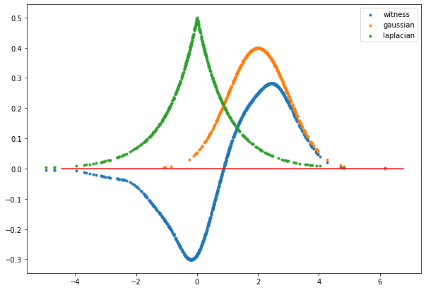
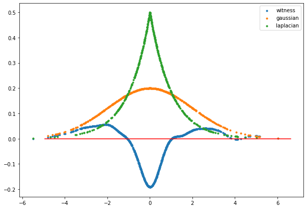
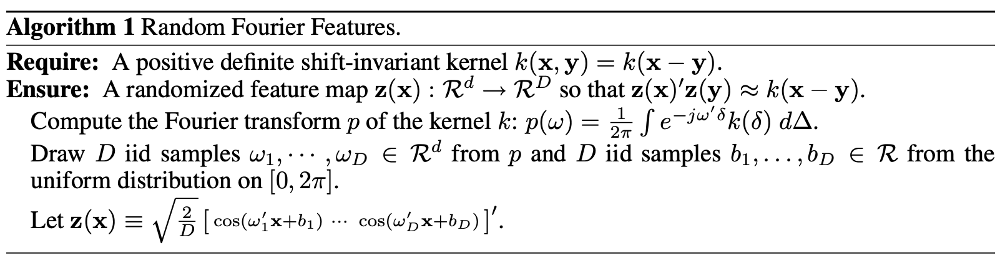

#### Idea
Kernel Reproducing Hilbert Space is a special hilbert space defined by a kernel function $k$ with reproducing property,    for any function $f$ in the space $\mathcal{H}$
$$
f(x) = \langle f(\cdot), k(x, \cdot)\rangle _{\mathcal{H}}
$$
and

$$
k(x, x') = \langle k(x, \cdot), k(x', \cdot) \rangle _{\mathcal{H}} = \langle \phi(x), \phi(x') \rangle _{\mathcal{H}} = \phi(x)^{T}\phi(x')
$$

with inner product defined as dot product.

$k(x, \cdot)$ at every value of $x$ can be viewed as point-wise coordinates of the space $\mathcal{H}$. To understand the idea, here is an analogy in vector space.   

Suppose $u, v \in \mathbb{V} \subset \mathbb{R}^{2}$,

$$v = \begin{pmatrix} v_{0} \\ v_{1} \end{pmatrix}$$

In $\mathbb{V}, \exists e_{0} = \begin{pmatrix} 1 \\ 0 \end{pmatrix} \ and \ e_{1} = \begin{pmatrix} 0 \\ 1 \end{pmatrix}$, then   

$$
v = v_{0}\cdot e_{0} + v_{1}\cdot e_{1} 
$$

$$
v_{0} = v\cdot e_{0} 
$$

$$
v_{1} = v\cdot e_{1}
$$

$\{e_{0}, e_{1}\}$ is a set of orthonormal basis. $e_{i}$ can be viewed as a filter used to extract $i$-th element of $v$. Similarly, $k(x, \cdot)$ also can be viewed as a filter used to get value of function $f$ at $x$.  

* Relationship between vector space and function space   
Suppose $v \in \mathbb{V} \subset \mathbb{R}^{d}$,

$$v = \begin{pmatrix} v_{1} \\ v_{2} \\ \vdots \\ v_{d}\end{pmatrix}$$

$v(j) = v_{j} \ and \ j \in \{1, 2, \cdots, d \}$   
When $j$ takes continuous values, namely, $j \in \mathbb{R}$,then $v(j)$ becomes a function.   

* Function Norm   
Define the inner product of two vectors $\langle u, v\rangle = u\cdot v = \sum_{i=1}^{d}u_{i}v_{i}$
  
Similarly,

$$\langle f(\cdot), g(\cdot)\rangle \ = \int_{\chi}f(x)g(x)dx$$ 

if $f, g: \mathbb{R} \mapsto \mathbb{R}$

$$
\lVert f(\cdot)\rVert ^{2} = \ \langle f(\cdot), f(\cdot)\rangle \ = \int_{\chi}f(x)^{2}dx
$$

#### Kernel Embedding
Map a distribution to a Kernel Reproducing Hilbert Space

$$
\mu[P_{X}](x) = E_{x\sim P_{X}}[k(x, \cdot)] = \int_{\mathcal{X}} p(x')k(x, x')dx'
$$

Suppose a sample drawn from a distribution $P_{X}$ 

$x_{1}, x_{2}, \cdots, x_{m} \sim^{i.i.d} P_{X}$, then

$$ \mu_{P} = \frac{1}{m}\sum_{i=1}^{m} k(x_{i}, \cdot)$$

$$
\mu_{P_{X}}(x) = \langle \mu_{P_{X}}, k(x, \cdot)\rangle = \langle \frac{1}{m}\sum_{i=1}^{m}k(x_{i}, \cdot), k(x, \cdot)\rangle = \frac{1}{m}\sum_{i=1}^{m}k(x_{i}, x) \rightarrow E_{P_{X}}k(x, \cdot)
$$  
when $m \rightarrow \infty$

Then we can construct a witness function $f$ measuring difference between two distributions $P$ and $Q$ with any kernel and two samples $(x_{1}, \cdots, x_{m})\sim P$ and $(y_{1}, \cdots, y_{n}) \sim Q$ 
$$
f(\cdot) = \hat{\mu_{P}}-\hat{\mu_{Q}}
$$

$$
f(z) = \langle \hat{\mu_{P}}-\hat{\mu_{Q}}, k(z, \cdot)\rangle = \langle \hat{\mu_{P}},k(z, \cdot)\rangle - \langle \hat{\mu_{Q}},k(z, \cdot)\rangle = \frac{1}{m}\sum_{i=1}^{m}k(x_{i}, z) - \frac{1}{n}\sum_{j=1}^{n}k(y_{j}, z)
$$

Following is an example witness function for a gaussian distribution and laplacian distribution.  

* $X \sim \mathcal{N}(2, 1)$ and $Y \sim Laplace(0, 1)$ with rbf kernel $k(x,y) = exp(4(x-y)^{2})$

* $X \sim \mathcal{N}(0, 2)$ and $Y \sim Laplace(0, 1)$ with rbf kernel $k(x,y) = exp(4(x-y)^{2})$

Applications 

* Comparing two distributions 

Distance between two distributions $P_{X}$ and $Q_{Y}$ can be measured by  

$$
D(P_{X}, Q_{Y}) = \lVert \mu_{P_{X}} - \mu_{Q_{Y}}\rVert _{\mathcal{H}}
$$

$$
D^{2}(P_{X}, Q_{Y}) = E_{x, x'\sim P_{X}}k(x, x') - 2E_{x\sim P_{X}, y\sim Q_{Y}}k(x, y) + E_{y, y'\sim Q_{Y}}k(y, y')
$$

Maximum Mean Discrepancy (MMD) measure distance between mean embeddings by the worst case
difference of expected values and can be used in hypothesis testing for  

$$
H_{0}: P_{X} = Q_{Y} 
$$

$$
H_{1}: P_{X} \neq Q_{Y}
$$

* Covariate Shift Correction and Local Learning 

In supervised learning, suppose the training and test sets are drawn from different distributions. We can find a weighting of the training set such that minimizing a reweighted empirical error on the training set will come close to minimizing the expected loss on the test set. 

$$
\Delta := \lVert \sum_{i=1}^{n}\beta_{i}k(x_{i}, \cdot) - \mu[P_{X'}] \rVert
$$
with 

$$
\beta_{i} \ge 0 \ \forall i \in \{1, 2, \cdots, n \} \ and \ \sum_{i}\beta_{i} = 1
$$

#### Random Fourier Features
The kernel method has a bottleneck problem of scalability. Computation complexity of computing kernel matrix $K$ with $n$ training instances is $\mathcal{O}(n^{2})$. However, random fourier features algorithm can be used to construct feature maps given any shift-invariant kernel. 

Shift-invariance kernels are kernels whose values depend on difference between $x$ and $x'$, 

$$
k(x, x') = k(x-c, x'-c) \ \forall c \ constant
$$

