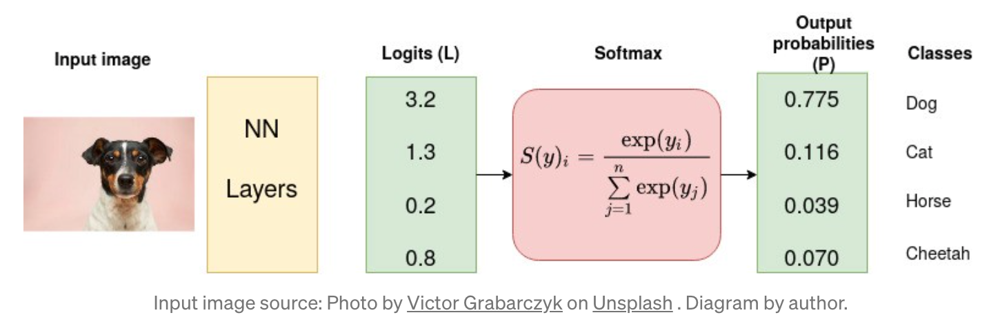
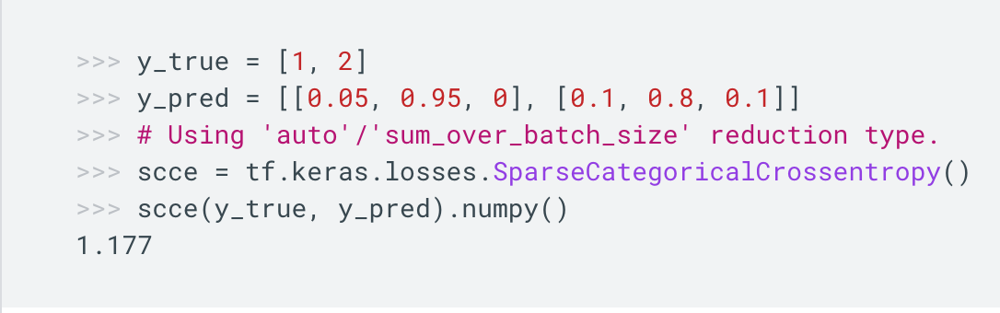

#### Bayesian

From Bayesian perspective, logistic regression can be viewed as a MLE with Bernoulli distribution 

$$
y|x, w \sim Bernoulli(\sigma(w^{T}x))
$$
with sigmoid function $\sigma(\cdot)$

$$
P(y|x, w) = (\sigma(w^{T}x))^{y}(1-\sigma(w^{T}x))^{(1-y)}
$$

$$
log[\frac{P(y=1|x, w)}{P(y=0|x, w)}] = w^{T}x
$$

With data $\mathcal{D}_{n} = \{(x_{1}, y_{1}), \cdots, (x_{n}, y_{n}) \}$ 
$$
\hat{w}^{MLE} = argmax_{w\in \Theta}\prod_{i=1}^{n}P(y_{i}|x_{i}, w) = argmin_{w\in \Theta} -\sum_{i}logP(y_{i}|x_{i}, w)
$$

#### Logistic Loss VS Cross Entropy

* Minimizing negative log likelihood with sigmoid likelihood (for binary classification) results in logistic loss.

$$
-logP(y_{i}|x_{i}, w) = -log\sigma(t_{i}) = -log\frac{1}{1+e^{-t_{i}}} = log(1+e^{-t_{i}})
$$ with $t_{i} = w^{T}x_{i}$

Hence, logistic loss is written as,

$$
l(z) = log(1+e^{-z})
$$

* When there are more than 2 classes, logistic loss is extended to cross-entropy.

$$
l(y, \hat{y}) = -\sum_{i=1}^{K}y_{i}log(\hat{y}_{i})
$$
with K classes

$\textbf{Categorical Cross-Entropy}$

Categorical Cross-Entropy is used when true labels are one-hot encoded.

$\textbf{Sparse Categorical Cross-Entropy}$

Sparse Categorical Cross-Entropy is used when true labels are single value encoded, e.g., [1], [2], etc. Calculation is pretty straight forward, 

- taking true labels as index to get elements in predicted labels (prob) at corresponding positions
- applying log function on the predicted labels (prob) and averaging over all observations in a batch.

$$
1.177 = -(log(0.95) + log(0.1))/2
$$

#### Cross Entropy Loss VS KL-Divergence Loss

Entropy measures how much information (in bits) required to represent an event drawn from a probability distribution (e.g., weather forecast for tomorrow's weather). 

Cross-Entropy measures how much information on average required to represent an event drawn from one distribution (P) compared to another distribution (Q).

KL-Divergence measures how much extra information on average required to represent an event drawn from one distribution compared to another one.

$$
KL-Divergence(P, Q) = Cross-Entropy(P, Q) - Entropy(P) 
$$

In machine learning, P is true distribution and Q is predicted distribution. Lower cross-entropy implies higher chance of approximating the true probability with the predicted probability. Both Cross-Entropy and KL-Divergence quantify difference between two distributions and they are asymmetric. 