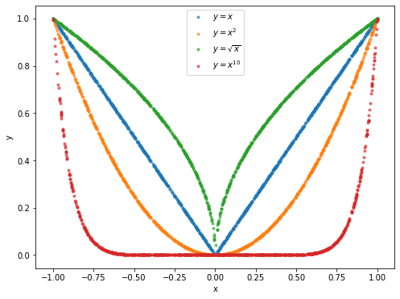
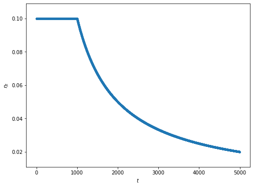

#### Objective Function Selection

#### Gradient Descent vs Stochastic Gradient Descent
Gradient Descent

* Loss function gets reduced smoothly and monotonically as iterations/epoches grow.
* High time complexity. 

Stochastic Gradient Descent

* Loss function fluctuates while getting reduced as iterations/epoches grow.
* May lead to early stop risks where the algorithm seems to converge, but actually is caused by the fluctuates.

Loss functions are sometimes not convex. As result, gradient descent method might converge to the local optimum. To avoid it, repeat training with adjusting learning rate. To guarantee gradient descent to converge,  

$$
\sum_{t}\eta_{t} = \infty
$$

$$
\sum_{t}\eta_{t}^{2} < \infty
$$

Annealing the learning rate  

$$
\eta_{t} = min(c_{1}, \frac{c_{2}}{t})
$$
where for example, $c_{1} = 0.1, c_{2} = 100$

#### Learning With Momentum
Weights are updated not only into direction of gradient, but also in direction of last weights update. For example, 

$$
a \leftarrow m\cdot a + \eta_{t}\nabla_{w}l(w;x, y)
$$

$$
w \leftarrow w - a
$$
where $m\cdot a$ is velocity and $m$ is called friction.

Benefits

* Avoid the gradient descent converging to the local optimum.
* Reduce oscillation while updating weights.

#### Second Order Methods

Hessian Matrix $Hl(w;x,y)$ is a square matrix of the second order partial derivative of loss function w.r.t weights. Intuitively, the Hessian describes the local curvature of the loss function, which allows us to perform a more efficient update. In particular, multiplying by the inverse Hessian leads the optimization to take more aggressive steps in directions of shallow curvature and shorter steps in directions of steep curvature.  

$$
w \leftarrow w - [Hl(w;x,y)]^{-1}\nabla_{w}l(w;x, y)
$$