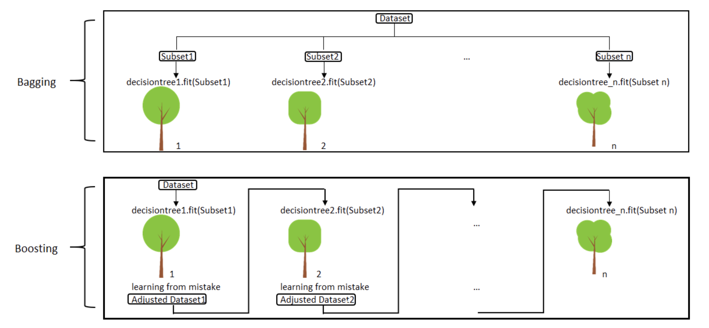
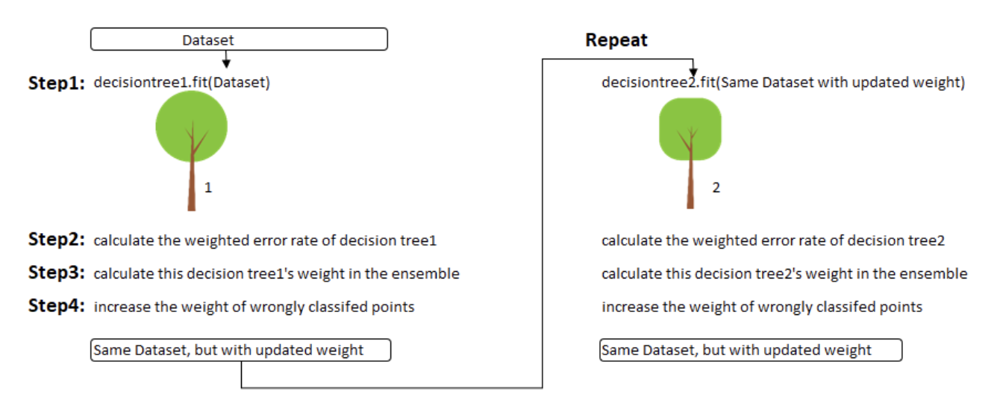
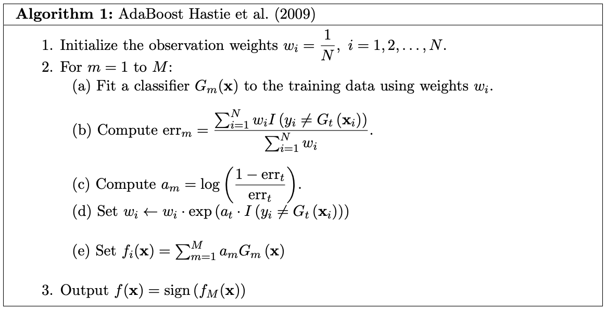
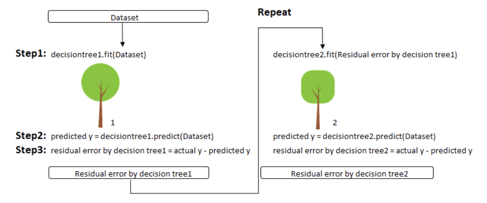
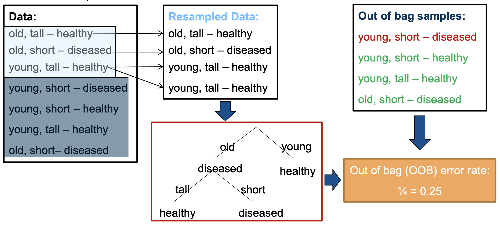

#### Bagging
Bagging is short for boostrap aggregating. Each tree is grown with a boostrap sample (sampling with replacements) drawn from traning dataset (the sample has the same size as the training set) and a random subset of features. 
$$
MSE = Variance + Bias^{2}
$$

\begin{equation}
\begin{split}
E[(f(x)-y)^{2}] & = E[f(x)^{2} - 2yf(x) + y^{2}] \\
& = E[f(x)^{2}] - 2yEf(x) + y^{2} \\
& = E[f(x)^{2}] - 2yEf(x) + y^{2} + [Ef(x)]^{2} - [Ef(x)]^{2} \\
& = \underbrace{E[f(x)^{2}] - [Ef(x)]^{2}}_\text{$Var(f(x))$} + \underbrace{[Ef(x)]^{2} - 2yEf(x) + y^{2}}_\text{$(Ef(x) - y)^2$} \\
& = variance + bias^{2}
\end{split}
\end{equation}

* To have small bias 
    * Increase depth of trees 
    * Reduce correlation among trees by decreasing the number of features of each tree   

* To have small variance  
    * Increase the number of trees 

#### Boosting
Boosting improves prediction accuracy from prior trees. Trees are correlated. 

* Adaptive Boosting

 
* Gradient Boosting

#### Out-of bag (OOB) error

Bagging has low variance and Boosting has high accuracy.