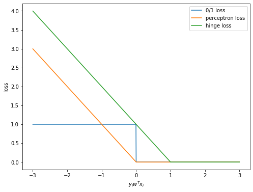

#### Loss Function
* 0/1 Loss (not convex and not differentiable) 
    $$
    l_{0/1}(x_{i}, y_{i}) = I_{[y_{i} \neq sign(w^{T}x_{i})]}
    $$
* Perceptron Loss  
    $$
    l_{p}(x_{i}, y_{i}) = max(0, -y_{i}w^{T}x_{i})
    $$
* Hinge Loss (encouraging margin) 
    $$
    l_{hinge}(x_{i}, y_{i}) = max(0, 1-y_{i}w^{T}x_{i})
    $$
 

#### Binary Classification
$$
l(x_{i}, y_{i}) = max(0, 1-y_{i}w^{T}x_{i}) + \lambda\lVert w\rVert ^{2}_{2}
$$

with data $\mathcal{D}_{n} = \{(x_{1}, y_{1}), \cdots, (x_{n}, y_{n}) \}$
$$
w^{\ast} = argmin_{w\in \Theta}\frac{1}{n}\sum_{i=1}^{n}l(y_{i}, w^{T}x_{i})
$$

* SVM with Kernel   
Since SVM is a linear classifier, model parameter $w$ can be written as 

$$\hat{w} = \sum_{i}\alpha_{i}y_{i}x_{i}$$

with perceptron loss, 
$$
l_{p}(y_{i}, w^{T}x_{i}) = max(0, -y_{i}w^{T}x_{i}) = max(0, -y_{i}(\sum_{j}\alpha_{j}y_{j}x_{j})x_{i}) = max(0, -\sum_{j}\alpha_{j}y_{i}y_{j}x_{i}x_{j})
$$ 

$x_{i}x_{j}$ can be replaced by $k(x_{i}, x_{j})$ 

$$
\hat{\alpha} = argmin_{\alpha \in \mathbb{R}}\frac{1}{n}\sum_{i=1}^{n}max(0, -\sum_{j}\alpha_{j}y_{i}y_{j}k(x_{i},x_{j}))
$$

$$
\hat{y_{i}} = \sum_{j}\alpha_{j}y_{j}x_{j}^{T}x_{i} = \sum_{j}\alpha_{j}y_{j}k(x_{j}, x_{i})
$$

Prediction of $y_{i}$ can be viewed as a linear weighed sum of contributions made by each training instance with   
    i) similarity measured by a kernel function between $x_{i}$ and feature of each training instance as weights  
    ii) $\alpha_{j}y_{j}$ as contribution of $j$-th instance.  

* Kernel Trick  
As long as the objective function only depends on inner product of $x_{i}$ and $x_{j}$, substitute the inner product with a kernel.

#### Multi-Classification

* Approach 1  
For each pair of classes build a binary classifier. Aggregate votes of all classifiers for a new instance for prediction. For $c$ classes, $\frac{c(c-1)}{2}$ classifiers are needed.  

* Approach 2  
Convert classes to binary encoding and build classifiers for each bit. For example, 10 classifers for 10 bits are able to represent 1032 classes. Risk of the approach is that the model might predict classes that don't exist.  

* Approach 3  
Suppose $c$ classes with parameters $w^{(1)}, \cdots, w^{(c)}$, given $(x_{i}, y_{i})$, then  

$$
(w^{(y_{i})})^{T}x_{i} > (w^{(j)})^{T}x_{i}, \ \forall j \in \{1, \cdots, c \} \ and\ j \neq y_{i}
$$

What we want  

$$
(w^{(y)})^{T}x > max_{i\neq y}(w^{(i)})^{T}x+1
$$

namely,  

$$
l_{mc-H}(w^{(1)}, \cdots, w^{(c)}; x, y) = max(0, 1+max(w^{(i)})^{T}x - (w^{(y)})^{T}x)
$$